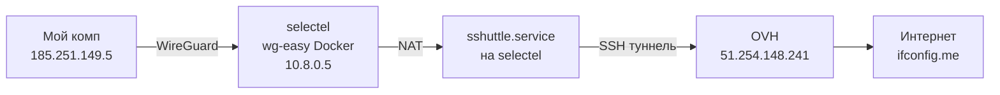

# Диагностика selectel — curl ifconfig.me и sshuttle

**Дата:** 2026-06-10  
**Сервер:** `selectel` (37.233.80.214, hostname: `streaming-antelao`)  
**Схема:** Мой комп → WireGuard (wg-easy на selectel) → sshuttle.service → OVH (51.254.148.241)

---

## Схема трафика



---

## Краткий вывод

`curl ifconfig.me` не работает из-за **комбинации двух проблем**:

1. **`sshuttle.service` падает** с `PermissionError` при обработке DNS (флаг `--dns`) — сервис не держится в рабочем состоянии.
2. **DNS на selectel сломан** — `/etc/resolv.conf` указывает на `188.93.16.19/188.93.17.19`, UDP-запросы к ним не проходят.

При этом **сам туннель sshuttle без `--dns` работает**: `curl --resolve ifconfig.me:80:34.160.111.145 http://ifconfig.me` возвращает IP OVH (`51.254.148.241`).

---

## Детали диагностики

### 1. sshuttle.service — главная проблема

**Unit-файл:** `/etc/systemd/system/sshuttle.service`

```ini
ExecStart=/usr/bin/sshuttle --method auto --dns -l 0.0.0.0:0 \
  -r fima@51.254.148.241 0.0.0.0/0 \
  --exclude 10.0.0.0/8 \
  --exclude 188.93.16.0/20
```

**Статус на момент диагностики:** `inactive (dead)` — был остановлен в 06:37 UTC.

**Ошибка при запуске (journalctl):**

```
PermissionError: [Errno 1] Operation not permitted
  File ".../sshuttle/client.py", line 418, in dns_done
    method.send_udp(sock, srcip, dstip, data)
  File ".../sshuttle/methods/__init__.py", line 77, in send_udp
    sock.sendto(data, dstip)
```

- sshuttle **подключается** к OVH (`c : Connected to server.`)
- **Падает через ~15 сек** при первом DNS-запросе через `--dns`
- Версия: **sshuttle 1.0.5** (старая, из apt)
- После падения остаются zombie-процессы `ssh`/`python3`, мешающие переподключению

**Проверка без `--dns`:** туннель работает, HTTP через OVH проходит.

### 2. DNS на selectel

| Проверка | Результат |
|----------|-----------|
| `curl ifconfig.me` | `Could not resolve host: ifconfig.me` |
| `dig ifconfig.me @188.93.16.19` | timeout (UDP) |
| `dig +tcp ifconfig.me @8.8.8.8` | ✅ `34.160.111.145` |
| `ping 8.8.8.8` | ✅ ~4 ms |
| `systemd-resolved` | ❌ не запущен |

`/etc/resolv.conf` → `188.93.16.19`, `188.93.17.19` (Selectel DNS) — **UDP недоступен**.

### 3. Прямой исходящий TCP с selectel (без sshuttle)

| Направление | Результат |
|-------------|-----------|
| TCP :80/:443 → интернет | ❌ timeout |
| TCP :22 → OVH | ✅ (иногда timeout из-за zombie ssh) |
| ICMP ping 8.8.8.8 | ✅ |
| SSH → OVH + curl | ✅ IP = `51.254.148.241` |

Selectel **не может** напрямую выходить в интернет по HTTP/HTTPS, но **может** через sshuttle → OVH.

### 4. WireGuard (wg-easy)

- Контейнер **wg-easy** работает (порт 51820/udp, 51821/tcp)
- WG-сеть: `10.8.0.0/24`
- Мой peer: `10.8.0.5` ← `185.251.149.5` (handshake OK)
- DNS для клиентов: `1.1.1.1` (`WG_DEFAULT_DNS`)

**Конфликт:** на хосте висит **лишний интерфейс `wg0`** (10.8.0.3/32) — не от wg-easy, `wg-quick@wg0` disabled, peer не подключён. Конфиг `/etc/wireguard/wg0.conf` — клиент к OVH (AllowedIPs 0.0.0.0/0), **не используется**.

### 5. Локальная машина (без VPN)

```bash
curl ifconfig.me  # → 185.251.149.5 (работает напрямую)
```

---

## Рекомендации по исправлению

### Быстрое (убрать `--dns`)

```ini
# /etc/systemd/system/sshuttle.service
ExecStart=/usr/bin/sshuttle --method auto -l 0.0.0.0:0 \
  -r fima@51.254.148.241 0.0.0.0/0 \
  --exclude 10.0.0.0/8 \
  --exclude 188.93.16.0/20
```

DNS для WG-клиентов уже задан в wg-easy (`1.1.1.1`) — перехват DNS через sshuttle не обязателен.

```bash
systemctl daemon-reload
systemctl restart sshuttle.service
```

### Исправить DNS на selectel

```bash
# /etc/resolv.conf или через resolvconf
nameserver 8.8.8.8
nameserver 1.1.1.1
```

Либо включить `systemd-resolved`.

### Убрать конфликтующий wg0 на хосте

```bash
ip link del wg0          # временно
# rm /etc/wireguard/wg0.conf  # если не нужен клиент к OVH
```

### Обновить sshuttle

```bash
pip install --upgrade sshuttle   # >= 1.1.x, баги с DNS исправлены
```

### Улучшить unit-файл

```ini
KillMode=mixed
TimeoutStopSec=15
# убрать --dns или обновить sshuttle перед включением --dns
```

---

## Команды для проверки

```bash
# Статус туннеля
ssh selectel systemctl status sshuttle.service

# Логи
ssh selectel journalctl -u sshuttle.service -f

# curl через туннель (на selectel)
ssh selectel curl -s ifconfig.me

# WG-клиенты
ssh selectel docker exec wg-easy wg show

# Проверка с клиента (при подключённом WG)
curl ifconfig.me   # должен показать 51.254.148.241
```

---

## Связанные хосты

| Host | IP | Роль |
|------|-----|------|
| selectel | 37.233.80.214 | WireGuard сервер + sshuttle клиент |
| vless (OVH) | 51.254.148.241 | Конечная точка выхода в интернет |
| wg-easy | Docker на selectel | WireGuard для клиентов |

---

## Теги

#selectel #sshuttle #wireguard #vpn #diagnostics #network
