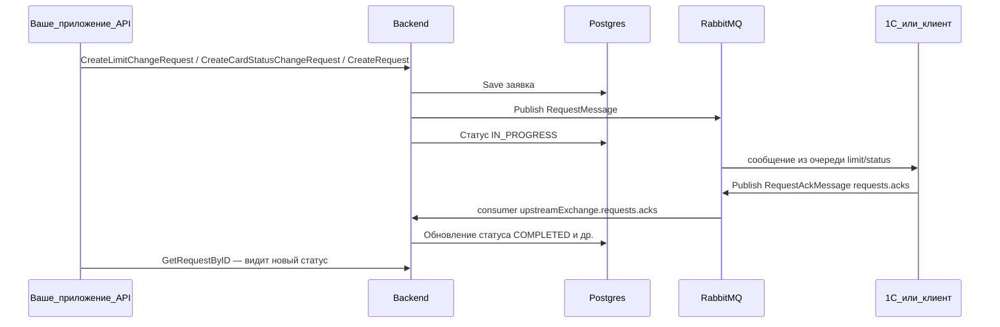

```mermaid 
  sequenceDiagram
   participant App as Ваше_приложение_API
   participant BE as Backend
   participant DB as Postgres
   participant RMQ as RabbitMQ
   participant Ext as 1С_или_клиент
   App->>BE: CreateLimitChangeRequest / CreateCardStatusChangeRequest / CreateRequest
   BE->>DB: Save заявка
   BE->>RMQ: Publish RequestMessage
   BE->>DB: Статус IN_PROGRESS
   RMQ->>Ext: сообщение из очереди limit/status
   Ext->>RMQ: Publish RequestAckMessage requests.acks
   RMQ->>BE: consumer upstreamExchange.requests.acks
   BE->>DB: Обновление статуса COMPLETED и др.
   App->>BE: GetRequestByID — видит новый статус
```