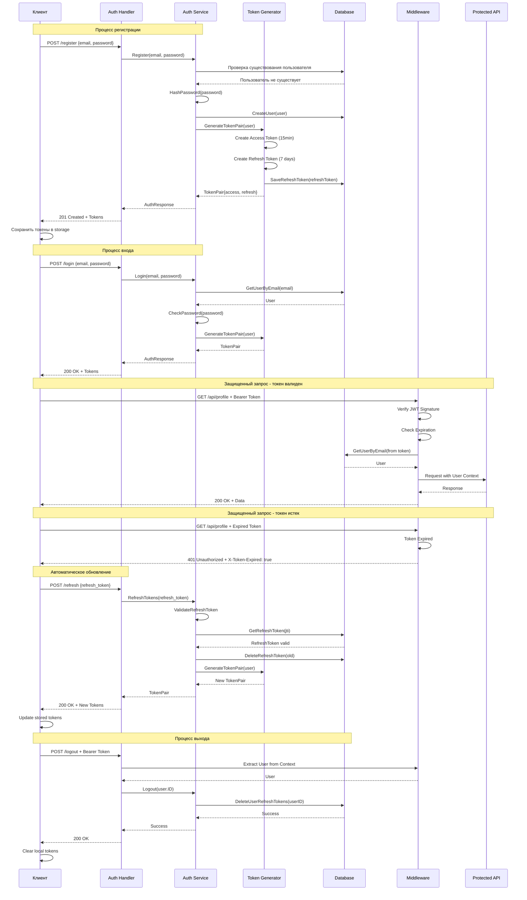
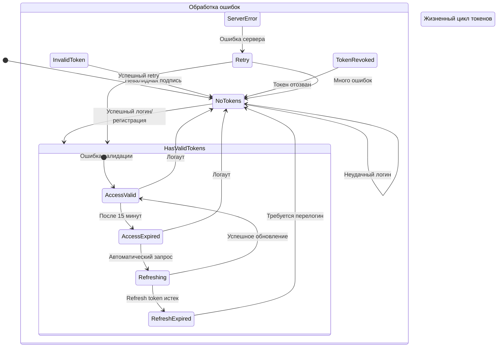
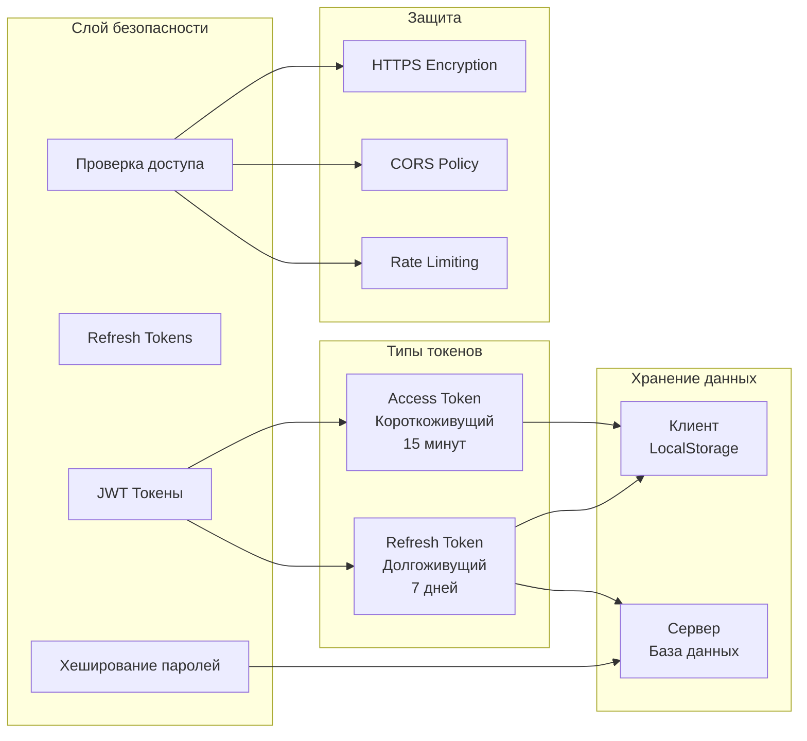
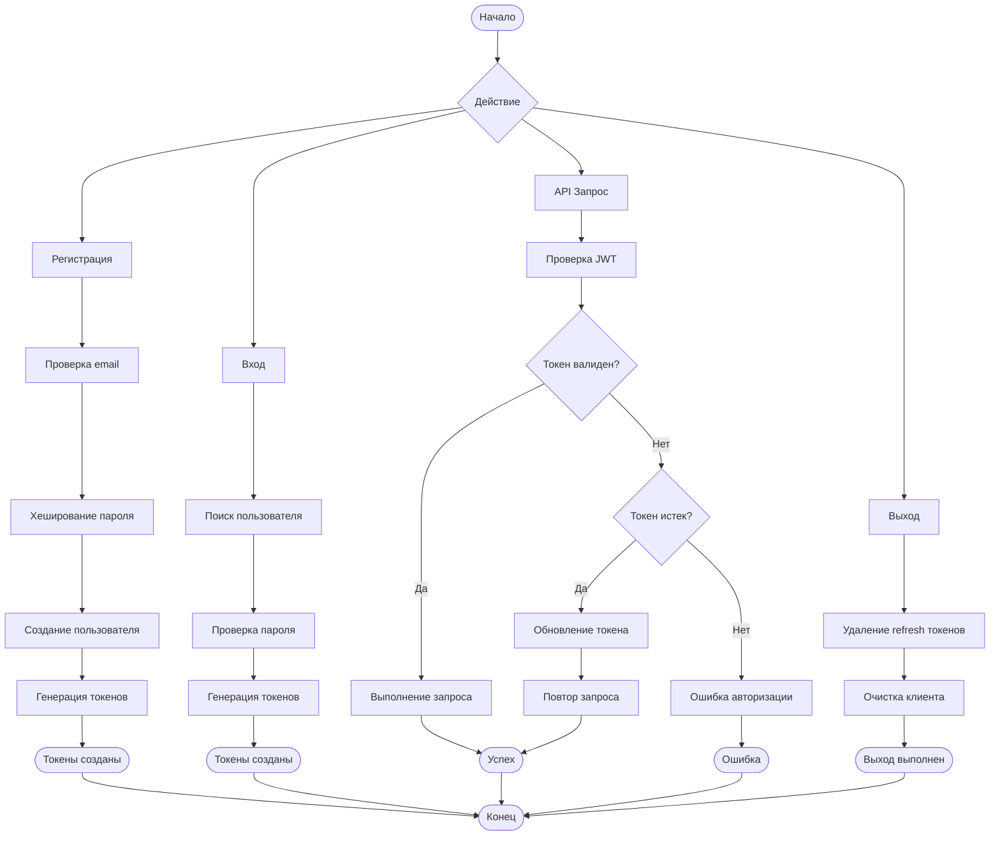

Создам для вас полную диаграмму авторизации с JWT токенами в формате Mermaid.

Полная диаграмма авторизации JWT

```mermaid
graph TB
    %% Стили для разных типов элементов
    classDef client fill:#e1f5fe,stroke:#01579b,stroke-width:2px
    classDef server fill:#f3e5f5,stroke:#4a148c,stroke-width:2px
    classDef database fill:#e8f5e8,stroke:#1b5e20,stroke-width:2px
    classDef success fill:#c8e6c9,stroke:#2e7d32,stroke-width:2px
    classDef error fill:#ffcdd2,stroke:#c62828,stroke-width:2px
    
    subgraph "Клиентское приложение"
        CLIENT[Клиент<br/>Web/Mobile App]
        STORE[Хранилище токенов<br/>LocalStorage/Cookies]
    end
    
    subgraph "Сервер авторизации"
        AUTH[Auth Handler]
        MIDDLEWARE[JWT Middleware]
        SERVICE[Auth Service]
        TOKEN_GEN[Генератор токенов]
    end
    
    subgraph "База данных"
        USERS[(Таблица пользователей)]
        REFRESH_TOKENS[(Таблица refresh токенов)]
    end
    
    %% Регистрация
    CLIENT -- "1. POST /register<br/>email, password" --> AUTH
    AUTH -- "2. Проверка данных" --> SERVICE
    SERVICE -- "3. Проверка существования<br/>пользователя" --> USERS
    USERS -- "4. Пользователь не существует" --> SERVICE
    SERVICE -- "5. Хеширование пароля" --> SERVICE
    SERVICE -- "6. Создание пользователя" --> USERS
    SERVICE -- "7. Запрос генерации токенов" --> TOKEN_GEN
    TOKEN_GEN -- "8. Генерация access token<br/>(15 минут)" --> SERVICE
    TOKEN_GEN -- "9. Генерация refresh token<br/>(7 дней)" --> SERVICE
    SERVICE -- "10. Сохранение refresh token" --> REFRESH_TOKENS
    AUTH -- "11. Возврат токенов<br/>access + refresh" --> CLIENT
    CLIENT -- "12. Сохранение токенов" --> STORE
    
    %% Логин
    CLIENT -- "A. POST /login<br/>email, password" --> AUTH
    AUTH -- "B. Проверка учетных данных" --> SERVICE
    SERVICE -- "C. Поиск пользователя" --> USERS
    USERS -- "D. Пользователь найден" --> SERVICE
    SERVICE -- "E. Проверка пароля<br/>bcrypt.compare()" --> SERVICE
    SERVICE -- "F. Успешная проверка" --> TOKEN_GEN
    
    %% Защищенный запрос
    CLIENT -- "I. Запрос к API<br/>Authorization: Bearer {token}" --> MIDDLEWARE
    MIDDLEWARE -- "J. Проверка JWT токена" --> MIDDLEWARE
    MIDDLEWARE -- "K. Токен валиден" --> API[Защищенный API]
    MIDDLEWARE -- "L. Токен истек<br/>401 + X-Token-Expired: true" --> CLIENT
    
    %% Обновление токена
    CLIENT -- "M. POST /refresh<br/>refresh token" --> AUTH
    AUTH -- "N. Проверка refresh token" --> SERVICE
    SERVICE -- "O. Валидация подписи<br/>и срока действия" --> SERVICE
    SERVICE -- "P. Поиск в базе" --> REFRESH_TOKENS
    REFRESH_TOKENS -- "Q. Токен найден<br/>и не истек" --> SERVICE
    SERVICE -- "R. Удаление старого<br/>refresh token" --> REFRESH_TOKENS
    SERVICE -- "S. Генерация новой пары" --> TOKEN_GEN
    AUTH -- "T. Возврат новых токенов" --> CLIENT
    
    %% Логаут
    CLIENT -- "X. POST /logout" --> AUTH
    AUTH -- "Y. Получение user ID<br/>из контекста" --> SERVICE
    SERVICE -- "Z. Удаление всех<br/>refresh токенов пользователя" --> REFRESH_TOKENS
    AUTH -- "AA. Успешный ответ" --> CLIENT
    CLIENT -- "AB. Очистка локальных<br/>токенов" --> STORE
    
    %% Применение стилей
    class CLIENT,STORE client
    class AUTH,MIDDLEWARE,SERVICE,TOKEN_GEN,API server
    class USERS,REFRESH_TOKENS database
```

Детальная последовательность действий

Диаграмма состояний токенов

Архитектура безопасности

Поток данных между компонентами

Ключевые особенности системы:

1. Двух-токенная система - Access (короткий) + Refresh (долгий)
2. Автоматическое обновление - Клиент сам обновляет истекшие токены
3. Безопасное хранение - Refresh tokens в базе, возможность отзыва
4. Статус ошибок - Четкие коды для разных сценариев
5. Масштабируемость - Легко добавить новые провайдеры аутентификации

Эта диаграмма полностью описывает процесс авторизации от регистрации до логаута с автоматическим обновлением токенов.