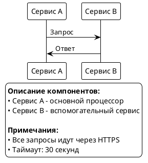
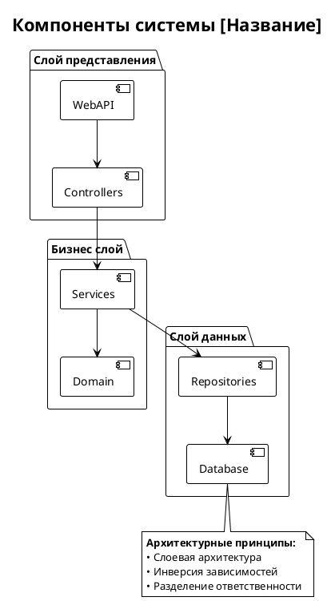
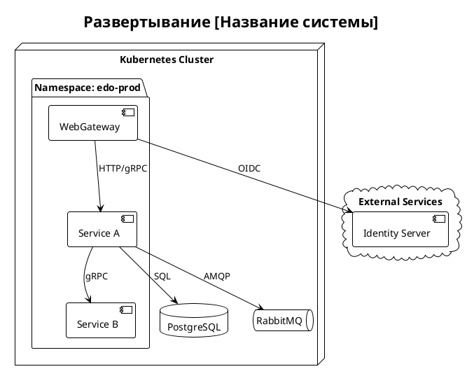
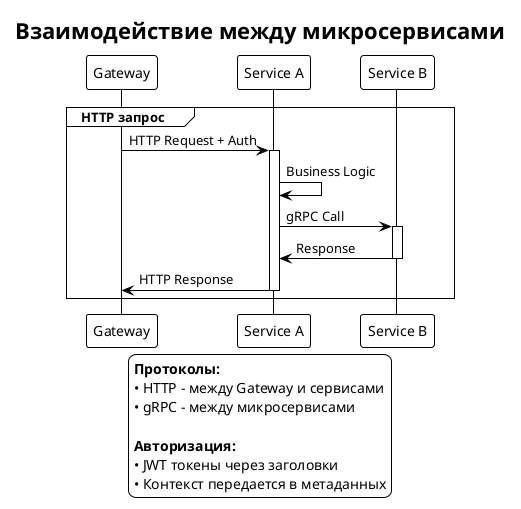

---
tags:
  - standards
  - documentation
aliases:
  - Documentation Headers Standard
  - Стандарт документации
audience:
  - developers
  - architects
type: standard
---
U
# Стандарт системы заголовков документации Fuel.App

## 🎯 Назначение


## 📚 Типы документации

### 1. Техническая документация (docs/)
**Аудитория**: Разработчики, архитекторы, DevOps  
**Назначение**: Подробное описание архитектуры, технических решений и реализации  
**Формат**: **Obsidian база знаний** с YAML frontmatter и wiki-ссылками

### 2. Пользовательская документация (docs/)  
**Аудитория**: Интеграторы, партнеры, клиенты  
**Назначение**: Описание API, сценариев использования и примеров

### 3. Модульная документация (*/readme.md)
**Аудитория**: Разработчики модуля  
**Назначение**: Описание конкретного модуля, компонента или сервиса

## 🏗️ Иерархия заголовков

### Уровни заголовков

| Уровень | Markdown | Назначение | Пример |
|---------|----------|------------|--------|
| **H1** | `#` | Название документа | `# CQRS - Техническая спецификация` |
| **H2** | `##` | Основные разделы | `## 🏗️ Архитектура` |
| **H3** | `###` | Подразделы | `### Pipeline Behaviors` |
| **H4** | `####` | Детализация | `#### Логирование операций` |
| **H5** | `#####` | Подпункты | `##### Конфигурация логирования` |
| **H6** | `######` | Минимальные единицы | `###### Параметры JSON` |

### 🚨 Ограничения

- **Максимальная глубина**: H6 (6 уровней)
- **H1**: Только один на документ (название)
- **H2**: Основные разделы (рекомендуется 3-8 разделов)
- **H3+**: Детализация без ограничений

## 🎨 Эмодзи система

### Категории эмодзи для H2 заголовков

| Категория | Эмодзи | Назначение |
|-----------|--------|------------|
| **Обзор** | 🎯 | Краткое описание, цели, назначение |
| **Архитектура** | 🏗️ | Структура, компоненты, схемы |
| **Конфигурация** | ⚙️ | Настройки, параметры, конфигурационные файлы |
| **Использование** | 🚀 | Примеры кода, инструкции, quick start |
| **API/Интерфейсы** | 🔧 | Описание API, интерфейсов, контрактов |
| **Функциональность** | ⚡ | Ключевые возможности, механизмы работы |
| **Компоненты** | 📋 | Списки компонентов, модулей, сервисов |
| **Безопасность** | 🛡️ | Авторизация, валидация, защита |
| **Мониторинг** | 📊 | Метрики, логирование, health checks |
| **Тестирование** | 🧪 | Unit тесты, интеграционные тесты |
| **Производительность** | ⚡ | Оптимизация, benchmarks, performance |
| **Развертывание** | 🚀 | Deployment, CI/CD, инфраструктура |
| **Проблемы** | ⚠️ | Ограничения, известные проблемы, troubleshooting |
| **Ссылки** | 🔗 | Связанные компоненты, зависимости |
| **Документация** | 📚 | Дополнительные материалы |

### Правила использования эмодзи

1. **H2 заголовки**: Обязательно используют эмодзи
2. **H3+ заголовки**: Эмодзи опциональны
3. **Консистентность**: Одинаковые темы = одинаковые эмодзи
4. **Один эмодзи**: Максимум один эмодзи на заголовок

## ⚠️ Правила о датах и версиях

**🚫 СТРОГО ЗАПРЕЩЕНО указывать в документации:**
- ❌ Даты создания документа (`📅 **Создан**: 2025-01-09`)
- ❌ Даты последнего обновления (`🔄 **Обновлен**: 2025-01-09`)
- ❌ Номера версий документации (`📅 **Версия**: 1.0`)
- ❌ Любые временные метки в заголовках
- ❌ Блоки типа `📅 **Версия**: 1.0 / ✍️ **Создан**: дата / 🔄 **Обновляется**: условие`

**✅ ПРИЧИНЫ:**
- **Git содержит полную историю** - все даты доступны через `git log`
- **Избежание устаревания** - ручное обновление дат часто забывается
- **Фокус на содержании** - важно содержание, а не время создания
- **Автоматическое отслеживание** - история изменений ведется автоматически
- **Избежание конфликтов** - даты создают ненужные merge conflicts

**📋 ИСКЛЮЧЕНИЯ:**
- Даты в описании релизов продукта (в Release Notes)
- Временные метки в логах и диагностике
- Даты в бизнес-требованиях и историях пользователей

## 📝 Шаблоны документов

### ⚡ **НОВЫЙ СТАНДАРТ: Obsidian формат с YAML frontmatter**

**ВСЯ новая документация в docs/` ОБЯЗАТЕЛЬНО должна включать YAML frontmatter!**

### Структура YAML frontmatter

Каждый документ должен начинаться с метаданных:

```yaml
---
tags:
  - category-tag
  - component-tag
  - type-tag
aliases:
  - Alternative Name
  - Русское название
audience:
  - developers
  - architects
  - devops
type: implementation | techspec | architecture | MOC | index | guide | standard
related:
  - Related-Document-1
  - Related-Document-2
---
```

#### Обязательные поля frontmatter

| Поле | Описание | Примеры значений |
|------|----------|------------------|
| **tags** | Теги для категоризации (минимум 2-3) | `architecture`, `ddd`, `cqrs`, `infrastructure`, `security`, `docflows` |
| **aliases** | Альтернативные названия документа | `DDD Implementation`, `Domain-Driven Design` |
| **audience** | Целевая аудитория | `developers`, `architects`, `devops`, `team-leads` |
| **type** | Тип документа | `implementation`, `techspec`, `architecture`, `MOC`, `index`, `guide`, `standard` |
| **related** | Связанные документы (опционально) | `DDD-TechSpec`, `CQRS-Implementation` |

#### Стандартные теги по категориям

**Архитектура**: `architecture`, `ddd`, `cqrs`, `microservices`, `seedwork`  
**Инфраструктура**: `infrastructure`, `entityframework`, `masstransit`, `longpolling`, `configuration`  
**Безопасность**: `security`, `authorization`, `gateway`, `token`  
**Документооборот**: `docflows`, `state-machine`, `transitions`  
**Развертывание**: `deployment`, `devops`, `environments`  
**Типы документов**: `implementation`, `techspec`, `MOC`, `index`, `guide`, `standard`

### Структура базы знаний Obsidian

#### MOC файлы (Maps of Content)

MOC файлы служат навигационными индексами для разделов документации. Они должны иметь:
- Префикс с номером для сортировки: `01-Архитектура.md`, `02-Инфраструктура.md`
- Тег `MOC` в frontmatter
- Структурированный список ссылок на документы раздела

Пример MOC файла:
```markdown
---
tags:
  - MOC
  - architecture
aliases:
  - Архитектура
---

# 🏗️ Архитектура системы

MOC (Map of Content) для архитектурной документации системы Astral.Edo.

## 📋 Основные архитектурные документы

### Микросервисная архитектура
- [[Microservices-Architecture]] - Полная документация слоевой архитектуры микросервисов

### Domain-Driven Design (DDD)
- [[DDD-Implementation]] - Полная документация DDD паттернов и реализации
- [[DDD-TechSpec]] - Краткая техническая спецификация DDD

## 🔗 Связанные разделы

- [[02-Инфраструктура|Инфраструктура и технологии]]
- [[03-Безопасность|Безопасность и авторизация]]
```

#### Главная страница базы знаний

Главная страница (`00-Главная.md`) должна содержать:
- Общий обзор базы знаний
- Навигацию по всем MOC файлам
- Быстрый поиск по тегам и типам документов

### 1. Техническая спецификация (*-TechSpec.md)

```markdown
---
tags:
  - architecture
  - component-name
  - techspec
aliases:
  - Component TechSpec
  - Компонент TechSpec
audience:
  - devops
  - team-leads
type: techspec
related:
  - Component-Implementation
---

# [Компонент] - Техническая спецификация

## 🎯 Краткий обзор
[Что это, зачем нужно, ключевые характеристики]

## 🏗️ Архитектура  
[Структура, диаграммы, основные компоненты]

## 📋 Ключевые компоненты
[Список основных элементов с описанием]

## ⚙️ Конфигурация
[Настройки, параметры, примеры конфигурации]

## 🚀 Использование
[Примеры кода, basic usage]

## 📊 Мониторинг
[Метрики, health checks, troubleshooting]

## 🔗 Связанные компоненты
[Зависимости, интеграции]

## 📚 Дополнительная документация
- [[Component-Implementation]] - подробная документация реализации
- [[Related-Component]] - связанный компонент
```

### 2. Подробная документация (*-Implementation.md)

```markdown
---
tags:
  - architecture
  - component-name
  - implementation
aliases:
  - Component Implementation
  - Компонент Implementation
audience:
  - developers
  - architects
type: implementation
related:
  - Component-TechSpec
  - Related-Component-Implementation
---

# [Компонент] - Документация реализации

## 🎯 Обзор и назначение
[Подробное описание проблемы и решения]

## 🏗️ Архитектурные решения
[Детальная архитектура, паттерны, принципы]

## 📋 Компоненты и интерфейсы
[Подробное описание всех компонентов]

## ⚡ Механизмы работы
[Детальные алгоритмы, flow диаграммы]

## 🔧 Детали реализации
[Специфика кода, сложные места]

## ⚙️ Конфигурация и настройка
[Подробные настройки, тюнинг]

## 🧪 Тестирование
[Стратегия тестирования, примеры тестов]

## 📊 Производительность и мониторинг
[Метрики, профилирование, оптимизация]

## ⚠️ Ограничения и известные проблемы
[Текущие ограничения, TODO, известные баги]

## 🔗 Интеграции и зависимости
[Подробные зависимости, взаимодействия]

## 📚 Расширенная документация
- [[Component-TechSpec]] - краткая техническая спецификация
- [[Related-Component-Implementation]] - связанный компонент
- [[Architecture-Overview]] - общая архитектура системы
```

### 3. README модуля

```markdown
# [Модуль] - Описание

## 🎯 Назначение
[Что делает модуль, его роль в системе]

## 🏗️ Структура
[Основные папки, файлы, организация]

## 🚀 Быстрый старт
[Как запустить, основные команды]

## ⚙️ Конфигурация
[Основные настройки для разработки]

## 🔧 API
[Основные контроллеры/сервисы, если есть]

## 🧪 Тестирование
[Как запустить тесты]

## 📚 Связанная документация
[Ссылки на техническую документацию]
```

### 4. API документация (astraledo-docs)

```markdown
# [API раздел] - Описание

## 🎯 Обзор
[Что делает API, основное назначение]

## 🚀 Быстрый старт
[Основные примеры использования]

## 🔧 Методы API
[Список эндпоинтов с кратким описанием]

## 📋 Сценарии использования
[Типичные use cases]

## ⚙️ Аутентификация и авторизация
[Как получить доступ]

## 📊 Мониторинг и отладка
[Как отслеживать вызовы API]

## 🔗 Связанные разделы
[Ссылки на другие части API]
```

## 🤖 Создание новых разделов документации

### 📋 Стандартный промт для ИИ-ассистента

При создании новых разделов документации используйте следующий промт для ИИ-ассистента:

```
Задача: Создание документации для [НАЗВАНИЕ ТЕМЫ/КОМПОНЕНТА/РАЗДЕЛА]

Инструкции:
1. 📚 ИЗУЧЕНИЕ: Проанализируй всю существующую документацию проекта
2. 🔍 ИССЛЕДОВАНИЕ: Изучи реальный код компонента/темы, найди его назначение и принципы работы
3. 📝 СОЗДАНИЕ: Создай полную документацию включающую:
   - TechSpec документ (краткая спецификация)
   - Implementation документ (подробная реализация)
4. 🔗 ИНТЕГРАЦИЯ: Обнови перекрестные ссылки в существующей документации
5. 🧹 ОПТИМИЗАЦИЯ: Убери дубликаты, ссылайся на существующие материалы
6. ✅ ПРОВЕРКА: Проверь актуальность всей документации и соответствие стандарту
7. 📊 ОТЧЕТ: Кратко сформулируй перечень внесенных изменений

Принципы работы:
❗ Пиши ТОЛЬКО по реальному коду - ничего не выдумывай
❗ Не уверен на 100% - не пиши, задавай вопросы
❗ Соблюдай стандарт заголовков проекта
❗ НЕ затрагивай папку astraledo-docs без явного указания
❗ 🚫 НИКОГДА НЕ ДОБАВЛЯЙ ДАТЫ в документы (создания, обновления, версии)
❗ В конце документа только: тип документа и аудитория

Obsidian формат (ОБЯЗАТЕЛЬНО для новой документации):
❗ ОБЯЗАТЕЛЬНО добавляй YAML frontmatter с tags, aliases, audience, type, related
❗ ОБЯЗАТЕЛЬНО используй wiki-ссылки [[filename]] вместо [text](./file.md)
❗ Используй теги из стандартного набора: architecture, infrastructure, security, docflows и т.д.
❗ Добавляй aliases для альтернативных названий документа
❗ Указывай related документы для навигации
❗ Обновляй MOC файлы (01-Архитектура.md, 02-Инфраструктура.md и т.д.) при добавлении новых документов

XML-комментарии в C# коде:
❗ Используй только поддерживаемые XML-теги: <para>, <list type="bullet">, <item><description>, <c>
❗ НЕ используй <see href="..."> - он не работает в C# IntelliSense
❗ Ссылки на документацию оформляй как: "Название: <c>docs/file.md</c>"
❗ Абзацы оборачивай в <para>, списки в <list type="bullet">
❗ НЕ используй markdown-разметку в XML-комментариях

API методы документация:
❗ **ОБЯЗАТЕЛЬНО** используй CDATA блоки в <remarks>: <![CDATA[...]]>
❗ **ОБЯЗАТЕЛЬНО** структурируй описание через <h3> HTML заголовки внутри CDATA
❗ **НЕ добавляй** `/// ` префиксы внутрь CDATA блока - это ломает парсинг
❗ Включай практические примеры в <pre><code> блоках с реальными URL
❗ Подробно описывай каждый параметр в многострочном формате с примерами значений
❗ Документируй ВСЕ релевантные HTTP коды (200, 400, 401, 403, 404, 500) с детализацией
❗ Для enum/статусов создавай раздел "Типичные значения" с <ul><li><code>значение</code></li></ul>
❗ Разделы "Ограничения" и "Поведение" оформляй списками <ol>/<ul>
❗ НЕ используй <see href="..."> ссылки - они не работают в CDATA блоках

Логирование в C# коде:
❗ 🚫 СТРОГО ЗАПРЕЩЕНО использовать эмодзи в логах (🔐, ✅, ❌, 📄, 🔒, etc.)
❗ 🚫 СТРОГО ЗАПРЕЩЕНО использовать префиксы в квадратных скобках ([ComponentName], [MethodName], etc.)
❗ 🚫 СТРОГО ЗАПРЕЩЕНО логировать успешные операции (получение блокировок, создание PDF, etc.)
❗ Логируй ТОЛЬКО проблемные случаи: ошибки (Error), предупреждения (Warning), отмены (Cancellation)
❗ Начинай сообщения с ключевого слова: ОШИБКА, TIMEOUT, ОТМЕНЕНА
❗ Включай ключевые параметры: операция, время выполнения, идентификаторы, сообщение об ошибке
❗ Логи должны быть машиночитаемыми и пригодными для поиска в production

Если есть вопросы или неясности - обязательно спрашивай.
```

### 🎯 Цели стандартного промта

1. **Качество контента** - документация основана только на реальном коде
2. **Полнота покрытия** - создание как кратких, так и подробных документов
3. **Интеграция** - связывание новых документов с существующими
4. **Консистентность** - соблюдение единого стандарта оформления
5. **Актуальность** - проверка и обновление всей связанной документации

### 📝 Адаптация промта

Промт можно адаптировать под конкретные нужды:

#### Для новых архитектурных компонентов:
```
Создай документацию для архитектурного компонента [НАЗВАНИЕ].
Фокус на: паттерны, принципы DDD/CQRS, интеграции с SeedWork.
```

#### Для новых API:
```
Создай документацию для API [НАЗВАНИЕ].
Фокус на: эндпоинты, контракты, сценарии использования.
```

#### Для новых сервисов:
```
Создай документацию для микросервиса [НАЗВАНИЕ].
Фокус на: назначение, зависимости, конфигурация, развертывание.
```

### ⚡ Результат применения промта

После выполнения промта должны быть созданы/обновлены:

- **2 новых документа**: TechSpec + Implementation
- **Обновленные ссылки** в существующих документах  
- **Актуализированный индекс** документации
- **Отчет об изменениях** с кратким описанием

## 🔗 Система перекрестных ссылок

### ⚡ **НОВЫЙ СТАНДАРТ: Obsidian формат ссылок**

**С этого момента ВСЯ новая документация в `docs/` ОБЯЗАТЕЛЬНО использует формат Obsidian!**

### Формат ссылок Obsidian

1. **Wiki-ссылки (ОБЯЗАТЕЛЬНО для новой документации)**: `[[filename]]` или `[[filename|текст ссылки]]`
2. **Внешние ссылки**: `[текст](https://example.com)` (остается без изменений)
3. **Ссылки на разделы**: `[[filename#section]]` или `[[filename#section|текст]]`

**Преимущества Obsidian ссылок:**
- ✅ Автоматическое автодополнение при вводе `[[`
- ✅ Визуализация связей через граф знаний
- ✅ Автоматическое обновление ссылок при переименовании файлов
- ✅ Навигация через backlinks и outgoing links
- ✅ Интеграция с тегами и метаданными

### Устаревший формат (только для совместимости)

Для существующих документов допускается использование старого формата:
1. **Внутри папки docs**: `[текст](./filename.md)` (постепенно заменяется на `[[filename]]`)
2. **Между разными папками**: `[текст](../folder/filename.md)` (постепенно заменяется на `[[filename]]`)
3. **На конкретный раздел**: `[текст](./filename.md#section)` (заменяется на `[[filename#section]]`)

### Стандартные блоки ссылок

#### В конце технической документации (Obsidian формат):
```markdown
## 📚 Дополнительная документация

- [[Component-Implementation]] - подробная документация
- [[Related-Component]] - связанный компонент
- [API Documentation](../astraledo-docs/docs/main/api/intro.md) - пользовательская документация

---

📄 **Краткая версия для**: DevOps, Team Leads, Архитекторы  
🔗 **Полная документация**: [[Component-Implementation]]
```

#### В конце технической документации (устаревший формат - только для совместимости):
```markdown
## 📚 Дополнительная документация

- **[Component-Implementation.md](./Component-Implementation.md)** - подробная документация
- **[Related-Component.md](./Related-Component.md)** - связанный компонент
```

#### В README модулей:
```markdown
## 📚 Связанная документация

- **[Техническая спецификация](../docs/Component-TechSpec.md)** - архитектура и технические детали
- **[Документация API](../astraledo-docs/docs/...)** - пользовательская документация
```

## 📊 Стандарты PlantUML диаграмм

### Общие правила для всех диаграмм

#### Заголовок и тема


#### Комментарии в коде диаграмм
```plantuml
' Это комментарий на русском языке
' Группировка логических блоков
group Название группы
    ' Описание взаимодействий
end
```

### Sequence диаграммы - ВАЖНЫЕ ПРАВИЛА

#### ✅ ПРАВИЛЬНО: Использование legend для справочной информации


#### ❌ НЕПРАВИЛЬНО: note bottom после завершения всех взаимодействий
```plantuml
' ❌ ЭТО ВЫЗЫВАЕТ ОШИБКИ:
SA -> SB: Последний запрос
deactivate SA
end

note bottom
    Справочная информация
end note
```

#### ✅ ПРАВИЛЬНО: Заметки внутри взаимодействий
```plantuml
SA -> SB: HTTP Request
note right of SA
    <b>Заголовки:</b>
    Authorization: Bearer token
    Content-Type: application/json
end note

SB -> SA: HTTP Response
```

#### ✅ ПРАВИЛЬНО: Заметки над участниками
```plantuml
note over SA, SB
    <b>Контекст взаимодействия:</b>
    Передача данных между сервисами
    через защищенное соединение
end note
```

### Component диаграммы

#### Стандартная структура


### Deployment диаграммы

#### Стандартная структура для Kubernetes


### Файловая структура диаграмм

#### Именование файлов
- **Формат**: `[ComponentName]-[DiagramType].puml`
- **Примеры**: 
  - `Authorization-Overview.puml`
  - `CQRS-Components.puml`
  - `LongPolling-Architecture.puml`

#### Размещение файлов
- **Техническая документация**: `docs/*.puml`
- **Модульная документация**: `docs/*.puml`

### Цветовая схема и стили

#### Рекомендуемые цвета для компонентов
```plantuml
!theme plain

' Цветовая схема
skinparam {
    BackgroundColor White
    ComponentBackgroundColor LightBlue
    PackageBackgroundColor LightGreen
    DatabaseBackgroundColor LightYellow
    QueueBackgroundColor LightCoral
}
```

#### Группировка с цветами
```plantuml
box "Frontend Layer" #LightBlue
    participant "Web App" as WA
end box

box "Gateway Layer" #LightGreen  
    participant "API Gateway" as GW
end box

box "Microservices" #LightCoral
    participant "Service A" as SA
end box
```

### Практические рекомендации

#### 1. Размер и читаемость
- Максимум 7-10 компонентов на диаграмме
- Используйте группировку для сложных схем
- Избегайте пересечения стрелок

#### 2. Комментирование
- Все комментарии на русском языке
- Пояснения к сложным взаимодействиям
- Описание нестандартных решений

#### 3. Легенды и заметки
- Используйте `legend bottom` для справочной информации
- `note` только внутри активных взаимодействий
- Избегайте `note bottom` после `@enduml`

#### 4. Валидация
- Проверяйте синтаксис через PlantUML preview
- Тестируйте рендеринг в разных инструментах
- Используйте простой синтаксис для совместимости

### Шаблоны для типовых диаграмм

#### Межсервисное взаимодействие


### Troubleshooting PlantUML

#### Частые ошибки и их решения

| Ошибка | Причина | Решение |
|--------|---------|---------|
| `Syntax error near line X` | `note bottom` после `end` | Используйте `legend bottom` |
| `Cannot find participant` | Заметка к несуществующему участнику | Проверьте имена участников |
| `Unexpected end of file` | Незакрытый блок | Проверьте `end` для всех блоков |
| `Invalid syntax` | HTML теги в legend | Используйте markdown синтаксис |

#### Валидация перед коммитом
```bash
# Проверка синтаксиса всех диаграмм
find . -name "*.puml" -exec plantuml -checkonly {} \;

# Генерация PNG для проверки рендеринга  
find . -name "*.puml" -exec plantuml -tpng {} \;
```

## 📊 Стандарты таблиц

### Сравнительные таблицы
```markdown
| Аспект | Вариант A | Вариант B |
|--------|-----------|-----------|
| **Производительность** | Высокая | Средняя |
| **Сложность** | Низкая | Высокая |
```

### Таблицы конфигурации
```markdown
| Параметр | Тип | По умолчанию | Описание |
|----------|-----|--------------|----------|
| **Enabled** | `bool` | `true` | Включить функциональность |
| **Timeout** | `int` | `30` | Таймаут в секундах |
```

### Таблицы API
```markdown
| Метод | Эндпоинт | Описание |
|-------|----------|----------|
| **GET** | `/api/status` | Получить статус |
| **POST** | `/api/process` | Создать процесс |
```

## ✅ Чеклист применения стандарта

### При создании нового раздела документации:
- [ ] Использован стандартный промт для ИИ-ассистента
- [ ] Создан TechSpec документ
- [ ] Создан Implementation документ (если необходимо)
- [ ] Обновлены перекрестные ссылки в существующих документах
- [ ] Обновлен главный индекс документации
- [ ] Составлен отчет об изменениях
- [ ] 🚫 ПРОВЕРЕНО: в новых документах НЕТ ДАТ

### При создании нового документа вручную:
- [ ] **ОБЯЗАТЕЛЬНО**: Добавлен YAML frontmatter с tags, aliases, audience, type, related
- [ ] Выбран правильный шаблон в зависимости от типа документа
- [ ] Заголовок H1 отражает назначение документа
- [ ] H2 разделы логично структурированы с эмодзи
- [ ] **ОБЯЗАТЕЛЬНО**: Использованы wiki-ссылки `[[filename]]` вместо `[text](./file.md)`
- [ ] Добавлены перекрестные ссылки на связанные документы в формате Obsidian
- [ ] Использованы стандартные форматы таблиц
- [ ] Обновлены соответствующие MOC файлы (01-Архитектура.md и т.д.)
- [ ] 🚫 НЕТ ДАТ создания, обновления или версий в документе

### При создании PlantUML диаграмм:
- [ ] Использован шаблон `@startuml DiagramName` с `!theme plain`
- [ ] Добавлен русский заголовок через `title`
- [ ] Для справочной информации использован `legend bottom` вместо `note bottom`
- [ ] Заметки `note` размещены только внутри активных взаимодействий
- [ ] Проверен синтаксис через PlantUML preview
- [ ] Файл назван по формату `[ComponentName]-[DiagramType].puml`

### При добавлении XML-комментариев в C# код:
- [ ] Использованы только поддерживаемые XML-теги (`<para>`, `<list>`, `<item>`, `<c>`)
- [ ] Абзацы обернуты в `<para>` для правильных отступов
- [ ] Списки оформлены через `<list type="bullet">` и `<item><description>`
- [ ] Файлы документации выделены через `<c>docs/filename.md</c>`
- [ ] НЕ использованы нерабочие `<see href="...">` ссылки
- [ ] НЕ использована markdown-разметка в XML-комментариях
- [ ] Проверено корректное отображение в IntelliSense

### При описании API методов:
- [ ] Краткий и понятный `<summary>` с описанием назначения
- [ ] Структурированный `<remarks>` в CDATA блоке с HTML разметкой
- [ ] Раздел "Базовое использование" обязательно присутствует
- [ ] Добавлены практические примеры в `<pre><code>` с реальными URL
- [ ] Все параметры имеют подробные многострочные описания
- [ ] Документированы основные HTTP коды ответов (200, 400, 404, 401, 403, 500)
- [ ] Специфические возможности (Long Polling, фильтрация и т.д.) вынесены в отдельные h3 разделы
- [ ] Добавлены ограничения (таймауты, размеры, лимиты) в отдельный раздел
- [ ] Указаны типичные значения для enum/статусов с описаниями

### При обновлении существующего документа:
- [ ] **РЕКОМЕНДУЕТСЯ**: Добавить YAML frontmatter если его нет
- [ ] Проверена и обновлена иерархия заголовков
- [ ] Добавлены эмодзи к H2 заголовкам согласно стандарту
- [ ] **РЕКОМЕНДУЕТСЯ**: Преобразовать ссылки в формат Obsidian `[[filename]]`
- [ ] Обновлены или добавлены перекрестные ссылки
- [ ] Приведены в соответствие таблицы и код блоки
- [ ] 🚫 УДАЛЕНЫ все даты создания, обновления или версий

## 🔧 Стандарты описания API методов в Swagger

### 🎯 Назначение стандарта API документации

API методы должны иметь богатую, структурированную документацию, которая обеспечивает:
- **Полное понимание функциональности** - что делает метод и как его использовать
- **Практические примеры** - реальные URL с параметрами для быстрого старта
- **Контекстную информацию** - поведение, ограничения, типичные значения
- **Красивое представление** в Swagger UI через HTML форматирование

### 🚀 **НОВЫЙ СТАНДАРТ: Обязательное использование CDATA блоков**

**С этого момента ВСЕ API методы ОБЯЗАТЕЛЬНО должны использовать CDATA блоки с HTML форматированием!**

**Почему CDATA + HTML:**
- ✅ **Красивые заголовки** - H3 теги создают четкую структуру
- ✅ **Подсветка кода** - CODE теги выделяют параметры и значения  
- ✅ **Читаемые примеры** - PRE/CODE блоки с правильным форматированием
- ✅ **Структурированные списки** - OL/UL для пошагового описания
- ✅ **Профессиональный вид** - соответствует лучшим практикам Swagger UI

**❌ Устаревший стандарт** (больше НЕ использовать):
- `<para>` теги - плохо выглядят в Swagger
- `<list type="bullet">` - нет красивого форматирования
- Простые XML теги - отсутствует структурирование

### ✅ Структура описания API метода

#### Обязательные элементы

```csharp
/// <summary>
/// Краткое описание назначения метода (без лишних отступов и "the" артиклей)
/// </summary>
/// <remarks>
/// <![CDATA[
/// <h3>Базовое использование</h3>
/// <p>Основное поведение метода. Что возвращает в стандартном случае.</p>
/// 
/// <h3>Специфические возможности</h3>
/// <p>Описание дополнительных режимов работы, если есть. Например:</p>
/// <p>При указании параметра <code>timeout</code> метод будет ожидать изменения до истечения времени.
/// Это позволяет получать уведомления об изменениях в реальном времени вместо постоянного опроса API.</p>
/// 
/// <h3>Примеры использования</h3>
/// <pre><code>// Базовый пример
/// GET /api/endpoint/parameter
/// 
/// // С параметрами
/// GET /api/endpoint/parameter?query=value&timeout=30
/// 
/// // POST запрос
/// POST /api/endpoint
/// {
///   "field": "value",
///   "array": ["item1", "item2"]
/// }
/// </code></pre>
/// 
/// <h3>Поведение при обработке</h3>
/// <ol>
/// <li>Валидация входных параметров</li>
/// <li>Выполнение бизнес-логики</li>
/// <li>Формирование и возврат ответа</li>
/// </ol>
/// 
/// <h3>Ограничения</h3>
/// <ul>
/// <li>Максимальный таймаут: 300 секунд (5 минут)</li>
/// <li>Максимум параметров: 10 значений в одном запросе</li>
/// <li>Сравнение значений регистронезависимое</li>
/// </ul>
/// 
/// <h3>Типичные значения</h3>
/// <ul>
/// <li><code>Value1</code> - описание первого значения</li>
/// <li><code>Value2</code> - описание второго значения</li>
/// <li><code>Value3</code> - описание третьего значения</li>
/// </ul>
/// ]]>
/// </remarks>
/// <param name="paramName">
/// Подробное описание параметра с контекстом использования.
/// Дополнительная информация о формате, валидации, поведении.
/// Примеры значений: <c>"example"</c>, <c>12345</c>
/// </param>
/// <response code="200">Успешный результат. Возвращает данные в формате объекта</response>
/// <response code="400">Некорректные параметры запроса (детализация ошибок)</response>
/// <response code="401">Требуется авторизация. Отсутствует или недействителен токен доступа</response>
/// <response code="403">Недостаточно прав доступа для выполнения операции</response>
/// <response code="404">Ресурс с указанным идентификатором не найден</response>
/// <response code="500">Внутренняя ошибка сервера. Подробности в логах</response>
/// <returns>Подробное описание возвращаемого объекта и его структуры</returns>
```

### 📋 Обязательные разделы в remarks

#### 1. **Базовое использование** (обязательно)
```html
<h3>Базовое использование</h3>
<p>Что делает метод в стандартном случае. Основное поведение без дополнительных параметров.</p>
```

#### 2. **Специфические возможности** (по необходимости)
Разделы типа:
- `<h3>Режим ожидания (Long Polling)</h3>`
- `<h3>Детализация переходов</h3>`
- `<h3>Фильтрация результатов</h3>`
- `<h3>Пагинация</h3>`

#### 3. **Примеры использования** (обязательно)
```html
<h3>Примеры использования</h3>
<pre><code>
// Базовый пример
GET /api/endpoint/12345

// Пример с параметрами
GET /api/endpoint/12345?param1=value1&param2=value2

// Сложный пример
POST /api/endpoint
{
  "field": "value",
  "array": ["item1", "item2"]
}
</code></pre>
```

#### 4. **Поведение** (при сложной логике)
```html
<h3>Поведение при обработке</h3>
<ol>
<li>Валидация входных параметров</li>
<li>Выполнение бизнес-логики</li>
<li>Формирование ответа</li>
</ol>
```

#### 5. **Ограничения** (по необходимости)
```html
<h3>Ограничения</h3>
<ul>
<li>Максимальное количество элементов: 1000</li>
<li>Время выполнения: до 30 секунд</li>
<li>Размер запроса: до 10 МБ</li>
</ul>
```

#### 6. **Типичные значения** (для enum, статусов, состояний)
```html
<h3>Типичные статусы</h3>
<ul>
<li><strong>Active</strong> - активный статус</li>
<li><strong>Inactive</strong> - неактивный статус</li>
<li><strong>Pending</strong> - ожидает обработки</li>
</ul>
```

### 🎨 Правила форматирования - ОБЯЗАТЕЛЬНО ИСПОЛЬЗОВАТЬ CDATA

#### **ГЛАВНОЕ ПРАВИЛО**: Всегда используйте CDATA блоки с HTML тегами

**Почему CDATA**: Обеспечивает красивое форматирование в Swagger UI с заголовками, списками и подсветкой кода.

#### ✅ ПРАВИЛЬНО: CDATA с HTML тегами
```csharp
/// <remarks>
/// <![CDATA[
/// <h3>Базовое использование</h3>
/// <p>Описание функциональности метода. Используйте <code>параметры</code> для выделения.</p>
/// 
/// <h3>Примеры использования</h3>
/// <pre><code>// Комментарий к примеру
/// GET /api/method?param=value
/// 
/// // Другой пример
/// POST /api/method
/// {
///   "field": "value"
/// }
/// </code></pre>
/// 
/// <h3>Ограничения</h3>
/// <ul>
/// <li>Первое ограничение</li>
/// <li>Второе ограничение</li>
/// </ul>
/// ]]>
/// </remarks>
```

#### ❌ НЕПРАВИЛЬНО: Обычные XML теги (плохо выглядит в Swagger)
```csharp
// ❌ НЕ ИСПОЛЬЗОВАТЬ - некрасиво в Swagger UI
/// <remarks>
/// <para>Описание без красивого форматирования</para>
/// <list type="bullet">
/// <item><description>Элемент списка</description></item>
/// </list>
/// </remarks>
```

#### 🎯 Поддерживаемые HTML теги в CDATA
- **`<h3>`** - заголовки разделов (ОБЯЗАТЕЛЬНО для структурирования)
- **`<p>`** - параграфы текста
- **`<code>`** - inline подсветка кода и параметров
- **`<pre><code>`** - блоки примеров кода
- **`<ul><li>`** - маркированные списки
- **`<ol><li>`** - нумерованные списки  
- **`<strong>`** - жирный текст для акцентов

#### 📐 Стиль написания CDATA блоков

**Структура CDATA блока:**
```csharp
/// <remarks>
/// <![CDATA[
/// <h3>Первый раздел</h3>
/// <p>Описание раздела.</p>
/// 
/// <h3>Второй раздел</h3>
/// <p>Другое описание.</p>
/// ]]>
/// </remarks>
```

**Основные правила:**
- **Всегда** начинайте с `<![CDATA[`
- **Всегда** заканчивайте `]]>`
- **Не добавляйте** `/// ` внутрь CDATA блока
- **Используйте** пустые строки между разделами
- **Обязательно** используйте `<h3>` заголовки для структурирования
- **Не используйте** теги `<see href="...">` - они не работают в CDATA

#### ⚠️ Запрещенные элементы в XML комментариях

```csharp
// ❌ НЕ ИСПОЛЬЗОВАТЬ
/// <see href="http://example.com">Ссылки</see>     // Не работает
/// <![CDATA[
/// /// Лишние слэши внутри CDATA                   // Ломает парсинг
/// ]]>
/// <h1>HTML заголовки вне CDATA</h1>               // Не поддерживается
```
```

### 📝 Стандарты описания параметров

#### Формат param комментариев
```csharp
/// <param name="paramName">
///     Основное назначение параметра.
///     Дополнительная информация: формат, ограничения, поведение.
///     Примеры значений или ссылки на enum.
/// </param>
```

#### Примеры хороших описаний параметров
```csharp
/// <param name="processId">
///     Идентификатор процесса в формате: 3 hex-символа типа + 36 символов GUID.
///     Hex-префикс определяет тип процесса для валидации ожидаемых статусов.
/// </param>
/// <param name="timeout">
///     Максимальное время ожидания изменений в секундах.
///     Если не указан - возвращается текущий статус без ожидания.
///     Максимальное значение: 300 секунд (5 минут).
/// </param>
/// <param name="includeDetails">
///     Включить детальную информацию в ответ.
///     При true добавляет дополнительные поля: timestamps, metadata, related objects.
/// </param>
```

### 🚨 HTTP Response коды

#### Обязательные response коды
Каждый API метод должен документировать основные коды ответов:

```csharp
/// <response code="200">Операция выполнена успешно</response>
/// <response code="400">Некорректные параметры запроса</response>
/// <response code="401">Требуется авторизация</response>
/// <response code="403">Недостаточно прав доступа</response>
/// <response code="404">Ресурс не найден</response>
/// <response code="500">Внутренняя ошибка сервера</response>
```

#### Специализированные коды (по необходимости)
```csharp
/// <response code="202">Запрос принят к обработке</response>
/// <response code="204">Операция выполнена, содержимое отсутствует</response>
/// <response code="409">Конфликт состояния ресурса</response>
/// <response code="422">Ошибка валидации данных</response>
/// <response code="429">Превышен лимит запросов</response>
```

### 📋 Шаблоны для типовых API методов

#### GET метод (получение ресурса)
```csharp
/// <summary>
///     Получить [ресурс] по идентификатору.
/// </summary>
/// <remarks>
///     <![CDATA[
/// <h3>Базовое использование</h3>
/// <p>Метод возвращает детальную информацию о [ресурсе]. Если ресурс не найден, возвращается HTTP 404.</p>
/// 
/// <h3>Дополнительные параметры</h3>
/// <p>Параметр <code>includeRelated</code> позволяет включить связанные объекты в ответ.</p>
/// 
/// <h3>Примеры использования</h3>
/// <pre><code>
/// // Получить базовую информацию
/// GET /api/resource/12345
/// 
/// // Получить с дополнительными данными
/// GET /api/resource/12345?includeRelated=true
/// </code></pre>
/// ]]>
/// </remarks>
/// <param name="id">Идентификатор ресурса</param>
/// <param name="includeRelated">Включить связанные объекты в ответ</param>
/// <response code="200">Ресурс найден и возвращен</response>
/// <response code="404">Ресурс с указанным идентификатором не найден</response>
/// <returns>Детальная информация о ресурсе</returns>
```

#### POST метод (создание ресурса)
```csharp
/// <summary>
///     Создать новый [ресурс].
/// </summary>
/// <remarks>
///     <![CDATA[
/// <h3>Базовое использование</h3>
/// <p>Метод создает новый ресурс на основе переданных данных. Возвращает созданный объект с присвоенным идентификатором.</p>
/// 
/// <h3>Валидация</h3>
/// <p>Все обязательные поля проверяются перед созданием. При ошибке валидации возвращается HTTP 422.</p>
/// 
/// <h3>Примеры использования</h3>
/// <pre><code>
/// POST /api/resource
/// {
///   "name": "Название",
///   "description": "Описание",
///   "status": "Active"
/// }
/// </code></pre>
/// ]]>
/// </remarks>
/// <param name="request">Данные для создания ресурса</param>
/// <response code="201">Ресурс успешно создан</response>
/// <response code="400">Некорректные данные в запросе</response>
/// <response code="422">Ошибка валидации полей</response>
/// <returns>Созданный ресурс с присвоенным идентификатором</returns>
```

#### PUT метод (обновление ресурса)
```csharp
/// <summary>
///     Обновить существующий [ресурс].
/// </summary>
/// <remarks>
///     <![CDATA[
/// <h3>Базовое использование</h3>
/// <p>Метод обновляет существующий ресурс. Заменяет все поля на переданные значения.</p>
/// 
/// <h3>Поведение</h3>
/// <ol>
/// <li>Проверка существования ресурса</li>
/// <li>Валидация переданных данных</li>
/// <li>Обновление всех полей</li>
/// <li>Возврат обновленного объекта</li>
/// </ol>
/// ]]>
/// </remarks>
/// <param name="id">Идентификатор обновляемого ресурса</param>
/// <param name="request">Новые данные ресурса</param>
/// <response code="200">Ресурс успешно обновлен</response>
/// <response code="404">Ресурс не найден</response>
/// <response code="422">Ошибка валидации данных</response>
/// <returns>Обновленный ресурс</returns>
```

#### DELETE метод (удаление ресурса)
```csharp
/// <summary>
///     Удалить [ресурс] по идентификатору.
/// </summary>
/// <remarks>
///     <![CDATA[
/// <h3>Базовое использование</h3>
/// <p>Метод выполняет мягкое удаление ресурса - устанавливает статус "Deleted" без физического удаления из базы.</p>
/// 
/// <h3>Поведение</h3>
/// <ol>
/// <li>Проверка существования и доступности ресурса</li>
/// <li>Проверка зависимостей (может блокировать удаление)</li>
/// <li>Установка статуса "Deleted"</li>
/// </ol>
/// 
/// <h3>Ограничения</h3>
/// <ul>
/// <li>Нельзя удалить ресурс, используемый в активных процессах</li>
/// <li>Удаление может быть заблокировано правами доступа</li>
/// </ul>
/// ]]>
/// </remarks>
/// <param name="id">Идентификатор удаляемого ресурса</param>
/// <response code="204">Ресурс успешно удален</response>
/// <response code="404">Ресурс не найден</response>
/// <response code="409">Ресурс не может быть удален из-за зависимостей</response>
/// <returns>Пустой ответ при успехе</returns>
```

### 📋 Чеклист для описания API метода

#### При создании нового API метода:
- [ ] Краткий и понятный `<summary>` без лишних отступов
- [ ] **ОБЯЗАТЕЛЬНО**: `<remarks>` в CDATA блоке `<![CDATA[...]]>`
- [ ] **ОБЯЗАТЕЛЬНО**: H3 заголовки для структурирования разделов
- [ ] Раздел "Базовое использование" присутствует первым
- [ ] Добавлены практические примеры в `<pre><code>` блоках
- [ ] Примеры содержат реальные URL и корректные эндпоинты
- [ ] Все параметры имеют подробные многострочные описания
- [ ] Документированы ВСЕ релевантные HTTP коды (200, 400, 401, 403, 404, 500)
- [ ] Специфические возможности (Long Polling, фильтры) в отдельных H3 разделах
- [ ] Добавлены разделы "Ограничения" и "Поведение" (если применимо)
- [ ] Указаны типичные значения для enum/статусов с `<code>` тегами
- [ ] **Проверено**: отсутствие `/// ` префиксов внутри CDATA блока

#### При обновлении существующего API метода:
- [ ] Обновлены примеры под текущую версию API
- [ ] Добавлены новые параметры (если появились)
- [ ] Актуализированы ограничения и поведение
- [ ] Проверена корректность HTTP кодов
- [ ] Добавлены недостающие разделы по шаблону

### ⚠️ Частые ошибки в API документации

| Ошибка | Проблема | Решение |
|--------|----------|---------|
| **Краткий summary** | "Получить данные" | "Получить статус процесса по идентификатору" |
| **Отсутствие CDATA** | Использование `<para>` тегов | **ОБЯЗАТЕЛЬНО** использовать `<![CDATA[...]]>` с HTML |
| **Неструктурированные remarks** | Сплошной текст в CDATA | Разбить на `<h3>` разделы внутри CDATA |
| **Префиксы в CDATA** | `/// ` внутри CDATA блока | Убрать все `/// ` префиксы из CDATA содержимого |
| **Отсутствие примеров** | Только текстовое описание | Добавить `<pre><code>` с реальными URL |
| **Общие параметры** | "ID объекта" | "Идентификатор процесса в формате: тип + GUID" |
| **Неполные HTTP коды** | Только 200 и 400 | Добавить 404, 401, 403, 500 с детализацией |
| **Отсутствие ограничений** | Нет информации о лимитах | Указать таймауты, размеры, ограничения в `<h3>` разделе |
| **Некорректные ссылки** | `<see href="...">` в CDATA | НЕ использовать - ссылки не работают в CDATA |

## 📝 Стандарты XML-комментариев в C# коде

### 🎯 Назначение XML-комментариев
XML-комментарии в C# коде должны обеспечивать:
- Качественную документацию в IntelliSense
- Ссылки на подробную техническую документацию
- Правильное форматирование с переносами строк и списками

### ✅ Правильные XML-теги

#### Структура базового комментария
```csharp
/// <summary>
/// Краткое описание класса/метода
/// </summary>
/// <remarks>
/// <para>
/// Подробное описание функциональности.
/// Может содержать несколько предложений.
/// </para>
/// <para>
/// Дополнительная информация во втором абзаце.
/// </para>
/// <para>
/// Подробная документация:
/// </para>
/// <list type="bullet">
/// <item><description>Название раздела: <c>docs/ComponentName-Implementation.md</c></description></item>
/// <item><description>Связанный компонент: <c>docs/RelatedComponent-Implementation.md</c></description></item>
/// </list>
/// </remarks>
```

#### Поддерживаемые XML-теги

| Тег | Назначение | Пример |
|-----|------------|--------|
| **`<para>`** | Абзац с правильными отступами | `<para>Текст абзаца</para>` |
| **`<list type="bullet">`** | Маркированный список | `<list type="bullet">...</list>` |
| **`<item><description>`** | Элемент списка | `<item><description>Текст</description></item>` |
| **`<c>`** | Выделение кода/файлов | `<c>docs/file.md</c>` |
| **`<paramref>`** | Ссылка на параметр | `<paramref name="paramName"/>` |
| **`<typeparamref>`** | Ссылка на generic параметр | `<typeparamref name="T"/>` |

### ❌ Неработающие теги (не использовать!)

#### Ошибочные ссылки
```csharp
// ❌ НЕ РАБОТАЕТ - отображается как пустой <description></description>
<item><description><see href="../docs/file.md">Название</see></description></item>

// ✅ ПРАВИЛЬНО - отображается корректно
<item><description>Название: <c>docs/file.md</c></description></item>
```

#### Неподдерживаемые markdown-теги
```csharp
// ❌ НЕ РАБОТАЕТ - markdown не поддерживается в XML
/// - Элемент списка
/// **Жирный текст**

// ✅ ПРАВИЛЬНО - используйте XML-теги
/// <list type="bullet">
/// <item><description>Элемент списка</description></item>
/// </list>
```

### 📋 Шаблоны для разных типов

#### Интерфейс/Класс с документацией
```csharp
/// <summary>
/// Описание назначения интерфейса/класса
/// </summary>
/// <remarks>
/// <para>
/// Подробное описание принципов работы и назначения.
/// Объяснение места в архитектуре системы.
/// </para>
/// <para>
/// Примеры использования: Example1, Example2, Example3
/// </para>
/// <para>
/// Подробная документация:
/// </para>
/// <list type="bullet">
/// <item><description>Основная документация: <c>docs/ComponentName-Implementation.md</c></description></item>
/// <item><description>Связанные компоненты: <c>docs/RelatedComponent-Implementation.md</c></description></item>
/// </list>
/// </remarks>
```

#### Метод с параметрами
```csharp
/// <summary>
/// Описание того, что делает метод
/// </summary>
/// <param name="paramName">Описание параметра</param>
/// <returns>Описание возвращаемого значения</returns>
/// <remarks>
/// <para>
/// Дополнительная информация о логике работы метода.
/// </para>
/// <para>
/// Автоматически обрабатывается через: <c>SomeComponent</c>
/// </para>
/// </remarks>
```

#### Behavior/Service класс
```csharp
/// <summary>
/// Behavior для [назначение] в CQRS pipeline
/// </summary>
/// <typeparam name="TIn">Тип входящего запроса</typeparam>
/// <typeparam name="TOut">Тип результата</typeparam>
/// <remarks>
/// <para>
/// Описание работы behavior в контексте CQRS архитектуры.
/// Место в порядке выполнения pipeline.
/// </para>
/// <para>
/// Подробная документация:
/// </para>
/// <list type="bullet">
/// <item><description>CQRS - [ComponentName]: <c>docs/CQRS-Implementation.md</c></description></item>
/// </list>
/// </remarks>
```

### 🔧 Правила ссылок на документацию

#### Формат ссылок
```csharp
// ✅ ПРАВИЛЬНО - краткое название : путь к файлу
<item><description>CQRS - Документация реализации: <c>docs/CQRS-Implementation.md</c></description></item>
<item><description>DDD - Сущности: <c>docs/DDD-Implementation.md</c></description></item>
<item><description>LiteStateMachine - Документация: <c>docs/LiteStateMachine-Implementation.md</c></description></item>
```

#### Приоритеты ссылок
1. **Основная документация компонента** - первая ссылка
2. **Архитектурная документация** (DDD, CQRS) - вторая ссылка  
3. **Связанные компоненты** - дополнительные ссылки

### 📋 Чеклист для XML-комментариев

#### При добавлении нового комментария:
- [ ] Использованы только поддерживаемые XML-теги
- [ ] Абзацы оформлены через `<para>`
- [ ] Списки используют `<list type="bullet">` и `<item><description>`
- [ ] Названия файлов выделены через `<c>`
- [ ] Нет попыток использовать `<see href="...">`
- [ ] Нет markdown-разметки в XML-комментариях
- [ ] Ссылки на документацию указаны в формате "Название: `<c>путь</c>`"

#### При обновлении существующего комментария:
- [ ] Проверено отображение в IntelliSense
- [ ] Убраны нерабочие `<see href="">` ссылки
- [ ] Markdown заменен на XML-теги
- [ ] Добавлены `<para>` для структурирования
- [ ] Списки преобразованы в `<list type="bullet">`

### ⚠️ Частые ошибки

| Ошибка | Проблема | Решение |
|--------|----------|---------|
| **`<see href="...">`** | Не работает в C# | Используйте `<c>docs/file.md</c>` |
| **Markdown списки** | `- элемент` не работает | Используйте `<list type="bullet">` |
| **Отсутствие `<para>`** | Слипшийся текст | Оборачивайте абзацы в `<para>` |
| **Длинные описания** | Плохая читаемость | Разбивайте на абзацы |
| **Неструктурированные ссылки** | Путаница в документации | Группируйте по типам |

## 🎯 Преимущества стандарта

- ✅ **Единообразие** - все документы следуют одной структуре
- ✅ **Навигация** - легко найти нужную информацию в любом документе  
- ✅ **Масштабируемость** - простое добавление новых документов
- ✅ **Читаемость** - эмодзи и структура улучшают восприятие
- ✅ **Связность** - перекрестные ссылки объединяют документацию
- ✅ **Профессиональность** - консистентный стиль повышает качество
- ✅ **Корректные XML-комментарии** - правильное отображение в IntelliSense
- ✅ **Богатая API документация** - структурированные описания с примерами в Swagger UI
- ✅ **Быстрый старт для разработчиков** - практические примеры с реальными URL
- ✅ **Полнота контекста** - подробная информация о поведении, ограничениях и типичных значениях
- ✅ **База знаний Obsidian** - визуализация связей через граф знаний, автоматическое автодополнение ссылок
- ✅ **Метаданные и теги** - категоризация и фильтрация документов по темам и аудитории
- ✅ **MOC навигация** - структурированные карты контента для быстрого доступа к разделам

---

📄 **Документ**: Стандарт системы заголовков  
🎯 **Назначение**: Унификация всей документации проекта
